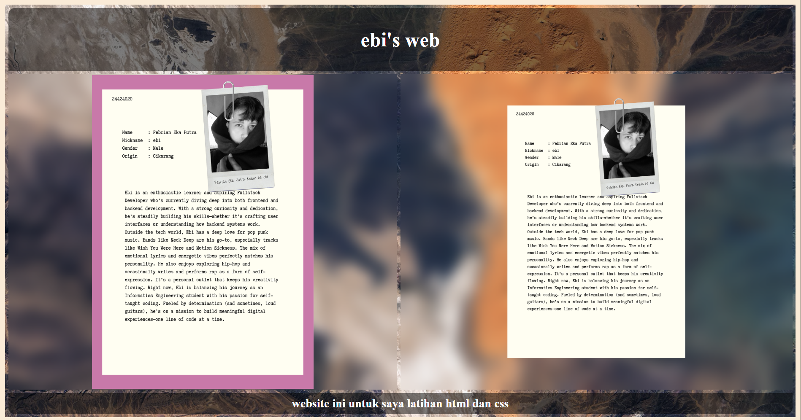
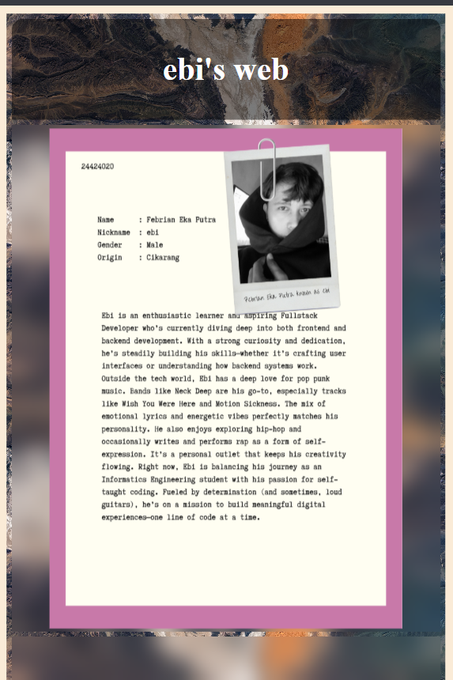

# 🌐Ebi's Web

Website ini dibuat sebagai latihan dasar HTML dan CSS, khususnya untuk membangun web **personal profile** sederhana dengan desain responsif dan layout grid. Dibuat oleh **Febrian Eka Putra** sebagai bagian dari pembelajaran otodidak.

---

## 🚀 Fitur Utama

- ✅ Layout responsif menggunakan **CSS Grid**
- ✅ Tampilan background dinamis (animated background zoom)
- ✅ Navigasi sederhana (header, 2 konten, footer)
- ✅ Gambar yang dapat diklik menuju profil media sosial
- ✅ Desain mobile-friendly menggunakan media query
- ✅ Efek hover interaktif

---

## 🧱 Struktur Grid

| Area Grid     | Keterangan                        |
|---------------|------------------------------------|
| `header`      | Menampilkan judul situs            |
| `content-1`   | Berisi gambar latar/link ke FB     |
| `content-2`   | Berisi gambar biodata              |
| `footer`      | Penutup dan penjelasan             |

---

## 📁 Struktur Folder

📁 project-folder
│
├── index.html
├── style.css
├── README.md
└── assets/
└── image/
└── biodata.png
└── stopmapfolio.png

---

## 🎨 Styling & Responsif

- Menggunakan background image dari Unsplash dengan animasi zoom menggunakan `@keyframes`.
- Layout menggunakan `grid-template-areas` untuk mengatur posisi elemen.
- `@media screen` digunakan untuk menyusun ulang layout di perangkat dengan lebar di bawah 768px.

---

## 🔗 Link Sosial Media

Gambar pada `content-1` dapat diklik dan akan menuju profil Facebook Aa:
[facebook.com/hello.febrian](http://facebook.com/hello.febrian)

---

## 👨‍💻 Tujuan Projek

Projek ini bertujuan untuk:

- Melatih penggunaan struktur HTML dasar
- Memahami cara kerja CSS Grid dan media query
- Meningkatkan kemampuan styling dan interaktivitas CSS
- Membangun portfolio awal sebagai developer pemula

---

## 📸 Tampilan Web (Preview)

> 
> 
> 

---

## 📝 Catatan

> Website ini akan terus berkembang seiring bertambahnya kemampuan saya, Ebi 💻✨, di bidang HTML, CSS, JavaScript, termasuk penggunaan Node.js 🟢 sebagai runtime untuk pengembangan backend, serta penguasaan framework ⚙️ dan database 🗃️ 💪
